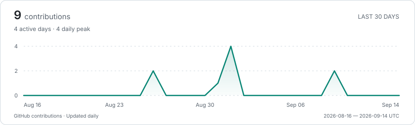

# YILING0013

Building practical tools for **AI, the web, and the desktop**.

[Email](mailto:sparxie.yilin@gmail.com) · [All repositories](https://github.com/YILING0013?tab=repositories)

### Selected work

**[AI Novel Generator](https://github.com/YILING0013/AI_NovelGenerator)** 
Long-form AI storytelling with connected chapters, context, and foreshadowing.

**[ChangeFolderIcon](https://github.com/YILING0013/ChangeFolderIcon)** 
A small WinUI 3 app to give your Windows folders a personal touch.

**[Shortcut Hint](https://github.com/YILING0013/Shortcut_Hint)** 
A desktop shortcut helper for keyboard-heavy applications.

**[NovelAI Local Web](https://github.com/YILING0013/novelai_local_web)** 
A local web interface for NovelAI image generation.

### Toolbox

`Python` · `TypeScript / JavaScript` · `C# / C++` 
`React / Next.js` · `Flask` · `Git / Linux`

Currently exploring **Blender** and **Unreal Engine**.

### Contribution activity

<picture>
  <source media="(prefers-color-scheme: dark)" srcset="./assets/activity-dark.svg">
  <source media="(prefers-color-scheme: light)" srcset="./assets/activity-light.svg">
  
</picture>
