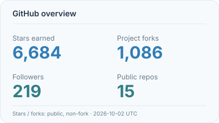
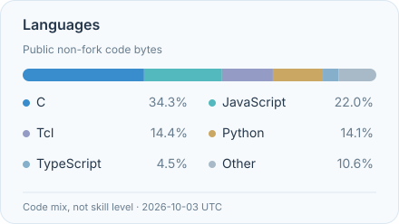
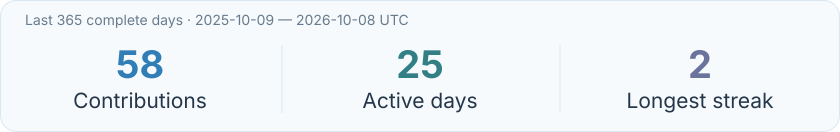
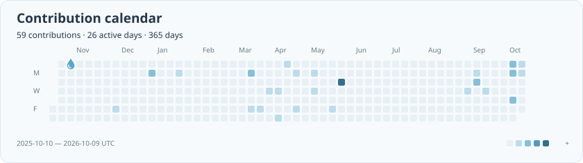
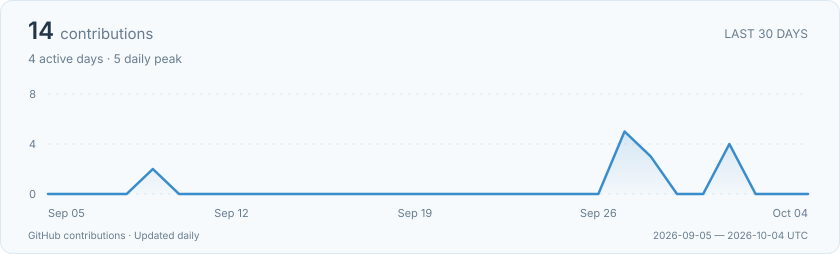

<picture>
  <source media="(max-width: 600px)" srcset="./assets/header-mobile.svg">
  
</picture>

  <a href="mailto:sparxie.yilin@gmail.com">Email</a>
  &nbsp; / &nbsp;
  <a href="https://github.com/YILING0013?tab=repositories">Repositories</a>
  &nbsp; / &nbsp;
  <a href="https://afdian.com/a/larissafro">爱发电</a>

### 项目

<table>
  <tr>
    <td width="420" valign="top">
      
<strong><a href="https://github.com/YILING0013/AI_NovelGenerator">AI Novel Generator</a></strong>

      
AI 长篇小说生成，连接章节、上下文与伏笔。

      
<a href="https://github.com/YILING0013/AI_NovelGenerator/stargazers"><picture><source media="(max-width: 600px)" srcset="./assets/stats/AI_NovelGenerator-mobile.svg"></picture></a>

      Python · AI writing
    </td>
    <td width="420" valign="top">
      
<strong><a href="https://github.com/YILING0013/ChangeFolderIcon">ChangeFolderIcon</a></strong>

      
基于 WinUI 3 的 Windows 文件夹图标工具。

      
<a href="https://github.com/YILING0013/ChangeFolderIcon/stargazers"><picture><source media="(max-width: 600px)" srcset="./assets/stats/ChangeFolderIcon-mobile.svg"></picture></a>

      C# · Windows
    </td>
  </tr>
  <tr>
    <td width="420" valign="top">
      
<strong><a href="https://github.com/YILING0013/Shortcut_Hint">Shortcut Hint</a></strong>

      
给常用应用准备的桌面快捷键提示助手。

      
<a href="https://github.com/YILING0013/Shortcut_Hint/stargazers"><picture><source media="(max-width: 600px)" srcset="./assets/stats/Shortcut_Hint-mobile.svg"></picture></a>

      TypeScript · Productivity
    </td>
    <td width="420" valign="top">
      
<strong><a href="https://github.com/YILING0013/novelai_local_web">NovelAI Local Web</a></strong>

      
在本地 Web 界面中使用 NovelAI 生成图像。

      
<a href="https://github.com/YILING0013/novelai_local_web/stargazers"><picture><source media="(max-width: 600px)" srcset="./assets/stats/novelai_local_web-mobile.svg"></picture></a>

      JavaScript · Image generation
    </td>
  </tr>
</table>

### GitHub 数据

  
  

查看贡献记录

 

<picture>
  <source media="(max-width: 600px)" srcset="./assets/stats/streak-mobile.svg">
  
</picture>

<picture>
  <source media="(max-width: 600px)" srcset="./assets/contribution-calendar-mobile.svg">
  
</picture>

<picture>
  <source media="(prefers-color-scheme: dark)" srcset="./assets/activity-dark.svg">
  <source media="(prefers-color-scheme: light)" srcset="./assets/activity-light.svg">
  
</picture>

Star / Fork 汇总公开非 Fork 仓库；语言占比按代码字节计算。采集日期见卡片。

### 常用技术

  
  
  
  
  
  
  
  

也在探索 Blender 与 Unreal Engine。

  

